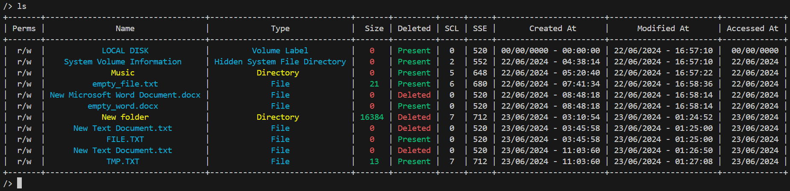
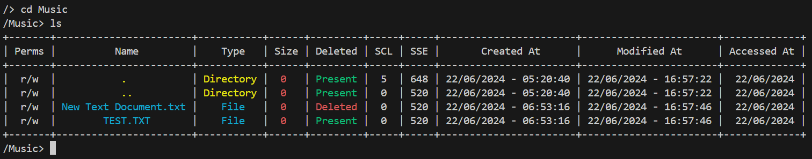

# Disclaimer
This software is still under development and it may contain bugs. If you find any please open an issue and I'll see what I can do!

# Instalation
After cloning the repo make sure you install the requirements:

## Linux
```bash
sudo apt-get install libmagic1 -y
pip install -r requirements_linux.txt
```

## Windows
```bash
pip install -r requirements_windows.txt
```

# How to run
You will need to provide a FAT12/16 logical disk image created with, preferably, FTK Imager or dd.

```
python3 readfs.py path/to/file
```

This will create an interactive session which will give you access to the root directory of the disk image. From there you have access to a bunch of commands. To see a list of all the available commands please run the following command `?`:

```
/> ?
+---------------+----------------------+-------------------------------------------------------+
|    Command    |         Args         |                      Description                      |
+---------------+----------------------+-------------------------------------------------------+
|    help|h|?   |                      |                  Shows this help menu                 |
|   ls|ll|dir   |                      |      Shows the contents of the current directory      |
|       cd      |         PATH         |                    Change directory                   |
|   clear|cls   |                      |                    Clears terminal                    |
|    cwd|pwd    |                      | Prints the full path to the current working directory |
|     chain     |   (cl|se|*) (FILE)   |       Display cluster and sector or both chains       |
|     entry     | (hex|raw) (FILE/DIR) |        Display entry (file or directory) bytes        |
| exit|quit|e|q |                      |                     Closes session                    |
+---------------+----------------------+-------------------------------------------------------+
```

Ok let's run the `ls` command and see it's output



Ok, now let's change directories (`cd`) and then use `ls`



Play around with the tool and find out what it does.

# Docker example
In case there are any odd errors please use the this docker image. This image also contains 2 disk images, so there is no need to create a FAT disk image.
```bash
docker pull doomdie/fat12-16-image-disk-reader:v0.2.0
docker run -it doomdie/fat12-16-image-disk-reader:v0.2.0
```

Once in the image run the following command
```bash
python3 readfs.py samples/fat_1gb_a_lot_of_data.001
```

From there you can use all the command showed above and and more.

# What's next?
- Improve session commands usability
- Code cleanup and documentation
- Adding new forensic features

# How to contribute?
Please, by all means, open issues and create PRs.<br>
I am also inclined to listen to feedback over on Discord. Here is my username: `doomdie`